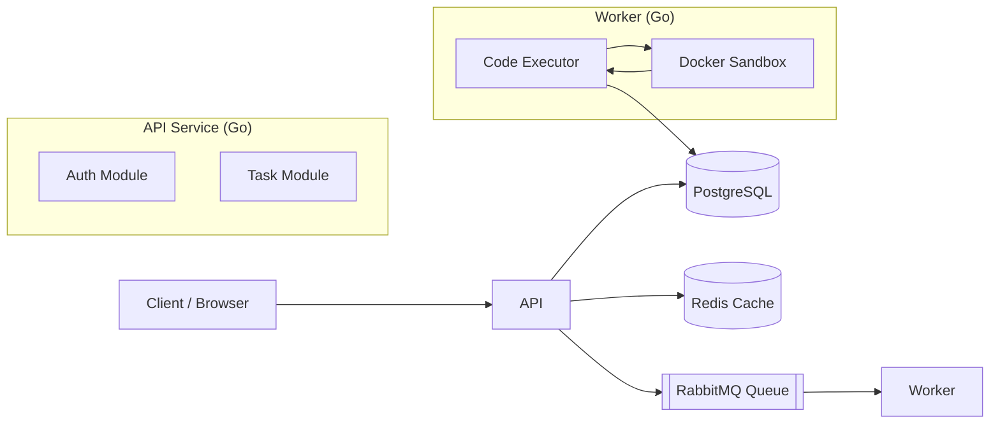
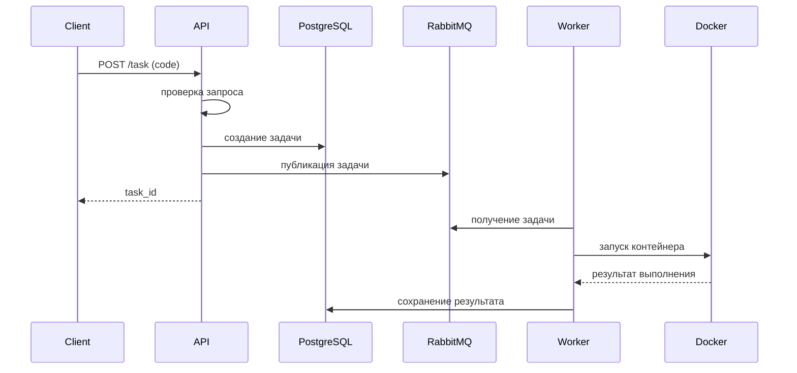

# Code Runner

## Project Description

Code Runner — это система для выполнения программного кода, обеспечивающая безопасное и масштабируемое исполнение задач.  
Система позволяет разработчикам отправлять код на выполнение и получать результаты.

---

## Features

- изолированное выполнение пользовательского кода
- асинхронная обработка задач через очередь
- масштабируемая архитектура воркеров
- ограничение ресурсов для sandbox

---

## Architecture


---

## Execution Flow



---

## Tech Stack
- Go
- Docker
- PostgreSQL
- RabbitMQ
- Redis Cluster
- Ansible
- GitHub Actions
- Docker Compose
- Make
- Pytest

---

## Security

Каждое выполнение кода происходит в изолированном контейнере Docker.

Ограничения sandbox:

- отсутствует сетевой доступ
- ограничение памяти
- ограничение CPU
- контейнер удаляется после выполнения

---

## Scalability

Система масштабируется горизонтально.

При увеличении нагрузки можно увеличить количество worker-сервисов,
которые будут параллельно обрабатывать задачи из RabbitMQ.

---

## Supported Translators
На текущий момент поддерживается:
- python
- g++
- gpp


---

## Installation

### Requirements

- Docker
- Docker Compose
- make

### Local Run

```bash
git clone https://github.com/kirmala/code_runner
cd code_runner
make dev-up
```

---

## API Example

### 1. Отправить код на выполнение

```
POST /task
```

Request:

```json
{
  "task_translator": "python",
  "task_code": "print('Hello world')"
}
```

Response:

```json
{
  "id": "33dbe291-248d-435d-8533-acee269c54e9"
}
```

---

### 2. Получить результат выполнения

```
GET /task/result/{id}
```

Response:

```json
{
  "result": "Hello world"
}
```

---

Полная документация API доступна в Swagger:

```
http://localhost:8080/swagger/index.html
```